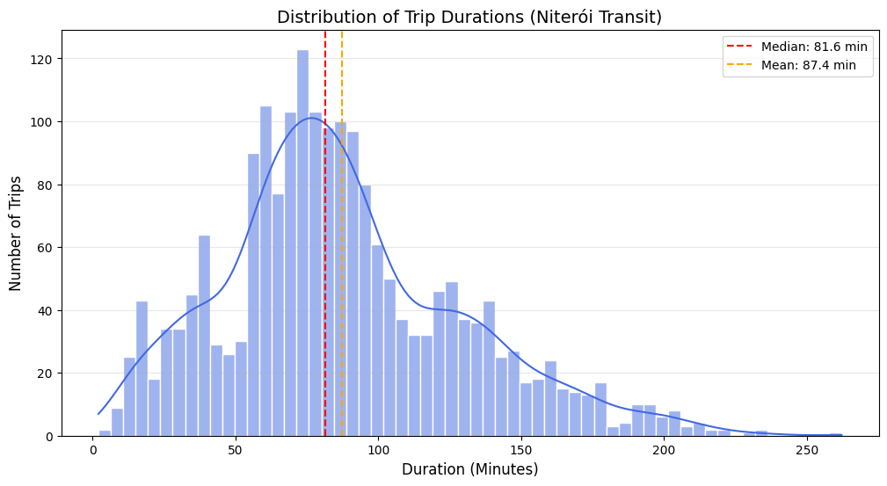
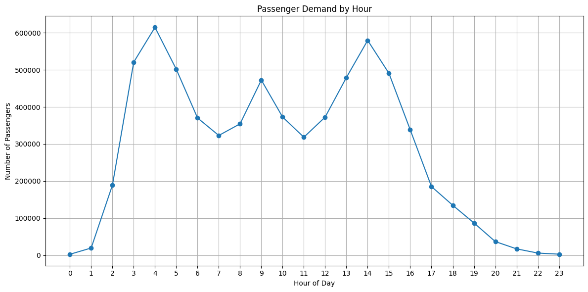
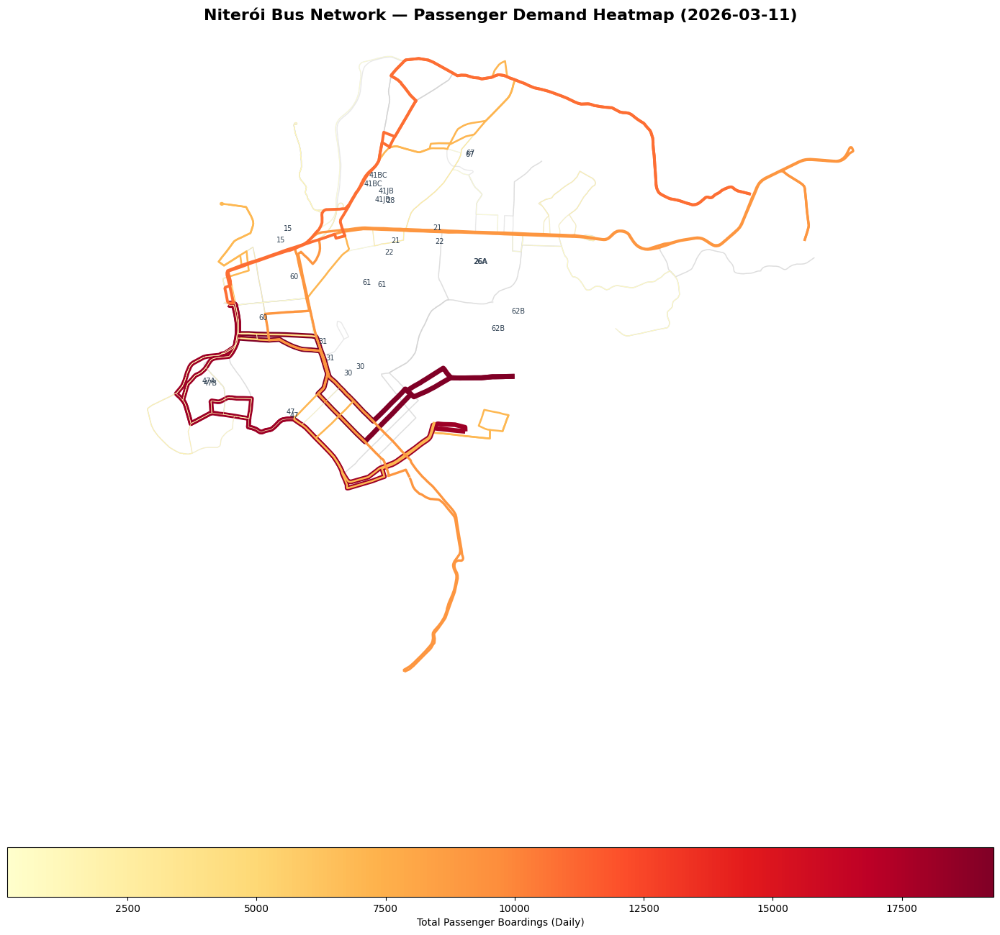
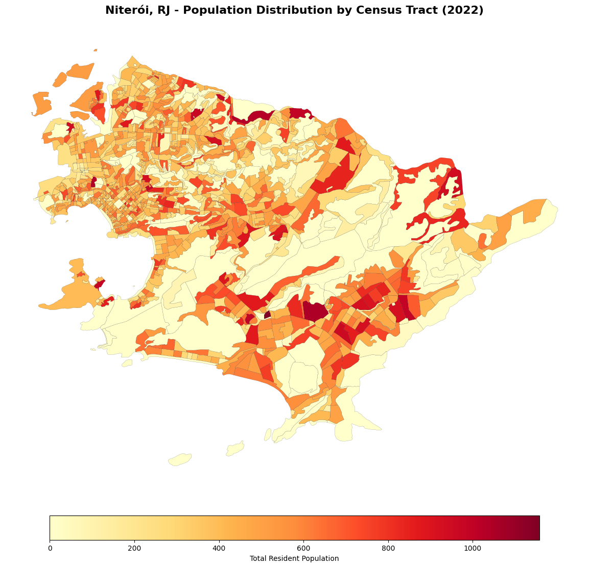

<!--  -->


# NetMob 2026: Public Transport & Passenger Demand in Niterói, RJ, Brazil

Welcome to the official repository of the **NetMob 2026 Data Challenge**, organized in collaboration with UFF, UFES, PUC Minas and research partners from across Brazil. This repository contains the dataset for the **NetMob 2026 Challenge**, focusing on public transport mobility and passenger demand in the city of Niterói, Rio de Janeiro, Brazil.

Researchers are invited to explore the dataset and contribute original findings on topics such as real time vehicle tracking, bus stop arriving prediction, social-aware trip analysis, and more.


## Overview

The dataset provides a comprehensive view of the urban mobility ecosystem in Niterói, combining three main sources of information:

1.  **Mobility Data:** Real-time GPS telemetry from the public bus fleet at every 15 seconds from March 11th to March 30th. See  [**README_Mobility.md**](README_Mobility.md) for schema and spatial coverage and   [**Mobility Notebook**](Notebooks/bus_mobility_data_characterization.ipynb) for data exploration.

<p align="center">

</p>


2.  **Ticket Data:**  6.7 millions Passenger transaction records (boardings) across the Niterói bus system. See  [**README_Ticket.md**](README_Ticket.md) for transaction types and categorical mappings and [**Ticket Notebook**](Notebooks/Ticket_Transactions.ipynb) for data exploration.


<p align="center">

</p>

Besides these two datasets  are not keyed to a shared individual identifier, they  can be integrated
through spatiotemporal alignment, which allows  joint analysis of vehicle movements and passenger demand and enables richer insights into system performance and usage.

<p align="center">

</p>


3.  **Points of Interest Data:** -  Auxiliar data - Official data containing points of interest mapping of hospital, schools, universities in the city. These datasets allow to analyze the social, economic and point of interest factors.  See [**README_Social.md**](data/social_data/README_social.md) a complete description.

4.  **Auxiliar  Data:**  - Bus stops and special bus stops, line route shapes, and weather conditions in the city during the collection period. This dataset allows to analyze the influence of weather in the passenger/trips behavior. 
**Collection Period:** March 2026.


5.  **Official Social and economic Data:** -  ibge_census_data_2022 - information on population size and composition, age, sex, race/ethnicity, literacy, education, household characteristics, sanitation, water supply, and others, grouped by  spatial boundaries of Niterói neighborhoods. See [**README_census.md**](data/ibge_census_data_2022/README_census.md) for details and [**Census Notebook**](Notebooks/Characterization_IBGE_Census_Data.ipynb) for data exploration. 
<p align="center">

</p>

---


## Repository Folder Structure

```text
Netmob2026/
├── README.md                       # Dataset overall description
├── README_Mobility.md              # GPS telemetry schema and coverage
├── README_Ticket.md                # Ticket transactions schema and detalis
├── Notebooks/                      # Reference Jupyter notebooks
├── data/                           # Datasets - Ticket, mobility, and social just after requesting
│   ├── mobility_data/              # Bus GPS telemetry (restricted access)
│   ├── ticket_data/                # Passenger boarding transactions (restricted access)
│   ├── social_data/                # Points of interest (health, education, mobility, etc.)
│   ├── auxiliar_data/              # Bus stops, route shapes, weather
│   └── ibge_census_data_2022/      # IBGE 2022 Census indicators for Niterói
│       ├── README_census.md        # Census variables and file mapping
```


---

## Dataset Structure

> Interested researchers must request the dataset. The datasets described in items 1, 2, and 3 are available only for the challenge participants after requesting in the (Data Challenge webpage)[https://netmob.org/www26/#data_challenge].


### 1. Mobility Data (GPS Telemetry)
Contains high-frequency positional data for buses operating in Niterói.
- **Location:** `data/mobility_data/` 
- **Details:** See [**README_Mobility.md**](README_Mobility.md) for schema and spatial coverage.

### 2. Ticket Data (Passenger Transactions)
Contains logs of every passenger boarding, including fare types and card categories.
- **Location:** `data/ticket_data/`
- **Details:** See [**README_Ticket.md**](README_Ticket.md) for transaction types and categorical mappings.

### 3. Point of Interest  Data 
Static reference files  with social points of interest, such as hospital, parking, pharmacies at Niterói. 
- **Location:** `data/social_data/`
- **Details:** See [**data/social_data/README_social.md**](data/social_data/README_social.md) for description of each file. 


### 4. Environment Data 
Static reference files of bus stops and  environmental data located in `auxiliar_data/`.

| File | Format | Description |
| :--- | :--- | :--- |
| `line_routes.json` | GeoJSON | Complete geometric shapes of all bus routes. |
| `stops.json` | GeoJSON | Official bus stops with street-level location. |
| `stops_integration_city.json` | JSON | Real-time snapshots near city integration terminals. |
| `stops_integration_metropolitan.json` | GeoJSON | Locations of major metropolitan interchange hubs. |
| `meteorological_data.csv` | CSV | Hourly weather data (Temp, Rain, Wind) during March 2026 from [oficial brazilian Metereology Institute database](https://bdmep.inmet.gov.br/). |

### 5. Niteroi IBGE Census Data 

This dataset contains spatial boundaries and census indicators for Niteroi, derived from the 2022 IBGE Census. The **IBGE Census** (*Censo Demográfico*) is the official national population and housing survey of Brazil, conducted by the **Instituto Brasileiro de Geografia e Estatística (IBGE)** -- Brazil's federal statistics agency.
- **Location:** `data/ibge_census_data_2022/`
- **Details:** See [**data/ibge_census_data_2022/README_census.md**](data/ibge_census_data_2022/README_census.md) for description of each file. 

---

## Getting Started: Notebooks

We provide six reference notebooks to help participants explore the data:

- [**Bus Mobility Data Characterization**](Notebooks/bus_mobility_data_characterization.ipynb): Exploration of GPS traces and vehicle patterns.
- [**Ticket Transactions Analysis**](Notebooks/Ticket_Transactions.ipynb): Analysis of passenger demand and fare patterns.
- [**IBGE Census Data Characterization**](Notebooks/Characterization_IBGE_Census_Data.ipynb): How to load the geospatial layers and merge them with demographic and infrastructure indicators of Niteróis Census Data. 
- [**Meteorological Analysis**](Notebooks/meteorological-analysis.ipynb): Investigation of weather patterns during the study period.
- [**Demand Mapping**](Notebooks/Cross_Dataset_Integration_Demand_Mapping.ipynb): Overlays ticket boarding counts onto GeoJSON route geometries to identify high-demand corridors.
- [**Headway & Frequency Analysis**](Notebooks/Operational_Data_Headway_and_Frequency_Analysis.ipynb): Computes wait times between consecutive buses and hourly service frequency from GPS telemetry data.
- [**Fare Revenue & Transaction Analysis**](Notebooks/Ticket_Data_Fare_Revenue_and_Transaction_Analysis.ipynb): Analyses passenger demographics, system revenue, and peak travel demand from ticket boarding data.

---

## Potential Use Cases

### Operational Data (GPS Telemetry)

- 🗺️ **Real-time vehicle tracking** on a map
- ⏱️ **Headway and frequency analysis** -- time between consecutive buses on the same route
- 📍 **Stop inference** -- detecting deceleration patterns near known stops
- 🔀 **Route deviation detection** -- comparing GPS trace against official GTFS shapes
- 🤖 **Arrival time prediction** -- ML models using lat/lng/angle/timestamp sequences
- 📊 **Fleet utilization analysis** -- active vehicles per route over time

### Ticket Data (Fare Transactions)

- 💰 **Fare revenue analysis** -- total fares collected by date, route, operator, and fare type
- 👥 **Passenger volume estimation** -- transaction counts as proxy for ridership and demand patterns
- 💳 **Card adoption rates** -- proportion of registered vs. unregistered/cash payment transactions
- 🏃 **Peak hour analysis** -- fare transaction distribution and demand variation by time period
- 🚌 **Route popularity & demand** -- which routes generate highest transaction volume
- 🔀 **Fare integration analysis** -- impact of multi-operator integration on ridership and revenue
- 📈 **Temporal trends** -- ridership patterns, seasonality, and growth across multiple days
- 🎯 **Passenger segmentation** -- analysis of fare types and subsidized ridership patterns
- 🔗 **Mode comparison** -- combining GPS traces with transactions to validate vehicle occupancy estimates

### Cross-Dataset Integration

- 🗺️ **Demand mapping** -- overlaying fare transactions with GPS routes to identify high-demand corridors
- ⏳ **Service efficiency** -- correlating operational metrics (headway, deviation) with passenger revenue
- 📊 **Origin-destination analysis** -- using auxiliary stops data and transaction records together
- 🎆 **Multi-modal flow** -- analyzing metropolitan integration terminals with transaction patterns

### Cross-Dataset Integration with Census & Points of Interest

Combining **Ticket**, **Mobility**, **Points of Interest (POI)** and **IBGE Census** data unlocks socially-aware mobility analyses. See [`data/ibge_census_data_2022/README_census.md`](data/ibge_census_data_2022/README_census.md) for census variables (demographics, literacy, household infrastructure, urban environment) at the census-tract and favela level.

- 🏘️ **Equity in service supply** -- compare bus headway/frequency (Mobility) and boarding density (Ticket) across census tracts stratified by income, literacy, or household infrastructure (Census) to detect underserved areas.
- 🧑‍🤝‍🧑 **Demand vs. demographic profile** -- model boarding counts (Ticket) per stop against the demographic composition (sex, age, race, household heads) of the surrounding census tract or favela.
- 🏠 **Favela mobility footprint** -- characterize trip origins/destinations (Ticket + Mobility) inside *Favelas e Comunidades Urbanas* (Census), and compare service quality (headway, delay) against the rest of the city.
- 🎓 **Education and health-driven flows** -- relate boarding peaks near universities, schools, hospitals, and basic health units (POI) with the demographic  area.
- 🌧️ **Weather x vulnerability** -- test whether rainfall (Meteorological) reduces ridership (Ticket) more strongly in census tracts with poor urban infrastructure (Census *entorno*, e.g., unpaved streets, no drainage).
- 🗳️ **Policy simulation** -- propose route or frequency redesigns combining demand (Ticket), operational feasibility (Mobility), POI accessibility, and census-derived equity indicators.


## Requesting Access

To request access to the dataset, please visit the Data Challenge portal:
👉 [https://netmob.org/www26/datachallenge](https://netmob.org/www26/datachallenge)

Access is granted upon agreement with the Terms and Conditions of the challenge.

##  License

This dataset is shared for non-commercial academic use only. Please refer to the Terms and Conditions upon access request.

---

## Data Source & Credits

- **Niterói City Hall:**  IBGE Data grouped by  spatial boundaries of Niterói neighborhoods. 
- **Mobnit API:** Real-time bus position and Ticket transactions data.
- **INMET:** Meteorological data from the Niterói station (A001).
